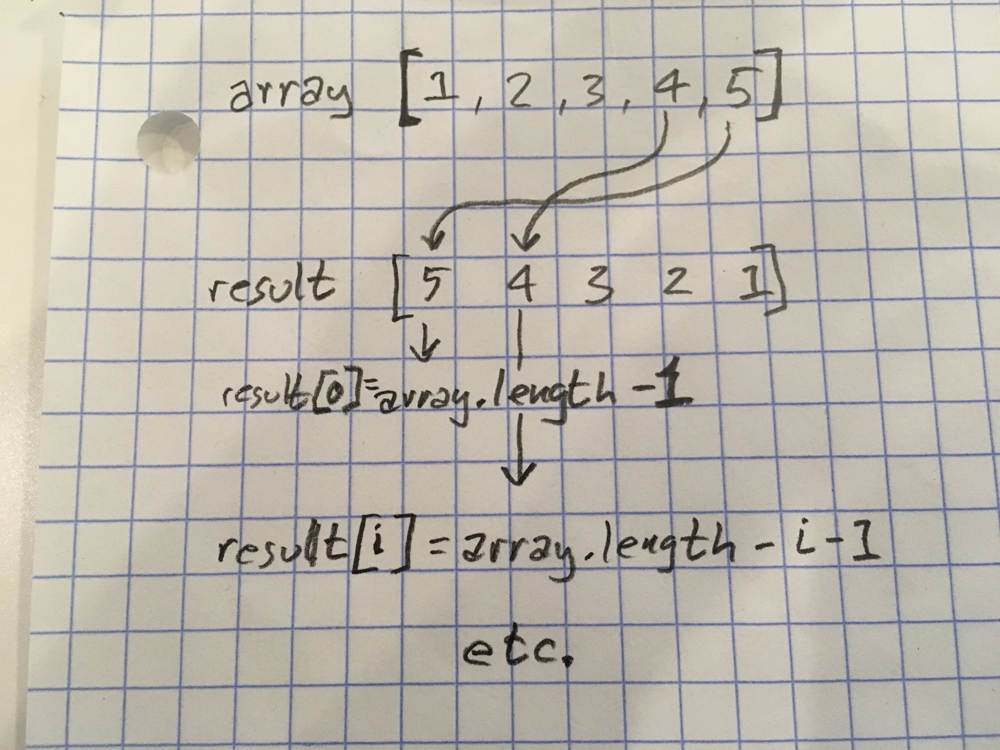

# Reverse an Array
Code Challenge: Class 01

## Challenge
Reverse the order of array elements without using built-in methods.

## Approach & Efficiency
Used array.length property to assign indexes of new array in reverse order.
One iteration through the array: Big O of n = n.

Stretch: 

Added last element to first, then subtracted first from it and replaced last with first. Then same with next index and next-to-last index, etc.
Alters input array rather than creating a new one, and only iterates through half the array, so n = n/2 (slope is improved.)

## Solution
Add '- i' to the result[0] code and it's the same for each iteration.

